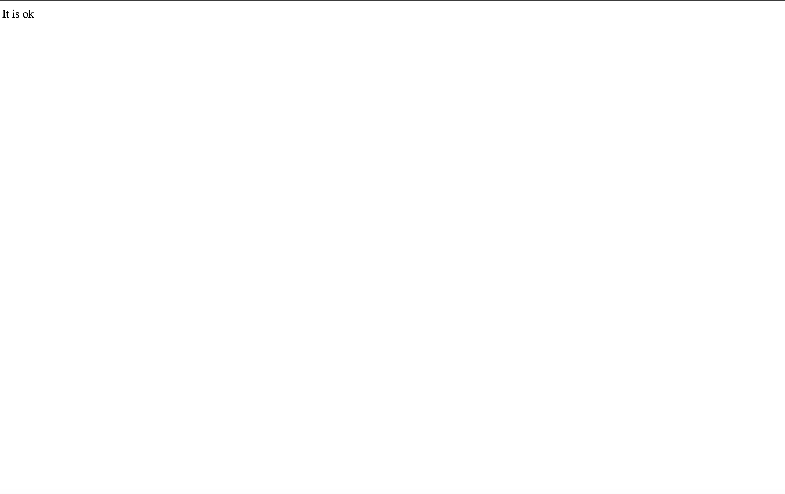
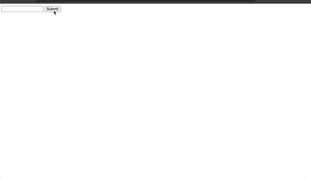

## Exception

#### Example 1

##### index.php

```PHP
<!DOCTYPE html>
<!--
To change this license header, choose License Headers in Project Properties.
To change this template file, choose Tools | Templates
and open the template in the editor.
-->

<html>

    <head>

        <meta charset="UTF-8">
        <title>This is the title</title>

    </head>

    <body>

        <?php
        
        function checkNum($num){
            
            if($num>1){
                
                throw new Exception("Value must be 1 bellow");
                
            }
            return true;
        }
        
        try {
        
            checkNum(1);
            echo 'It is ok';
            
        } catch (Exception $ex) {
            
            echo $ex->getMessage();
        }
        
        ?>
        
    </body>

</html>

```

##### upload.php

```PHP

<?php
session_start();

echo $_SESSION["name"];

//session_unset() and session_destory() by using these methods we can delete session variables.
?>
```
#### Output 



#### Example 2

##### index.php

```PHP
<!DOCTYPE html>
<!--
To change this license header, choose License Headers in Project Properties.
To change this template file, choose Tools | Templates
and open the template in the editor.
-->

<html>

    <head>

        <meta charset="UTF-8">
        <title>This is the title</title>

    </head>

    <body>

        <form action="upload.php" method="post">
            
            <input type="text" name="txt">
            <input type="submit">
            
        </form>
        
    </body>

</html>

```

##### upload.php

```PHP
<?php

   function checkPass($pass){
       
       if($pass=="kuna"){
           
           throw new Exception("Welcome kuna");
       
       }
       
       return true;
       
   }
    
    try{
        
        checkPass($_POST["txt"]); 
        echo "Somethig is wrong";
        
    }catch (Exception $ex){
        
        echo $ex->getMessage();
        
    }

?>
```

#### Output 


