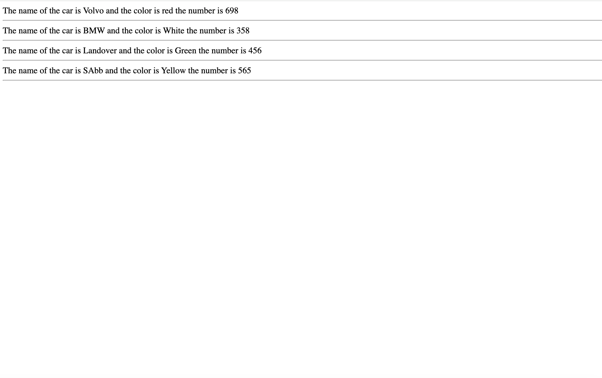
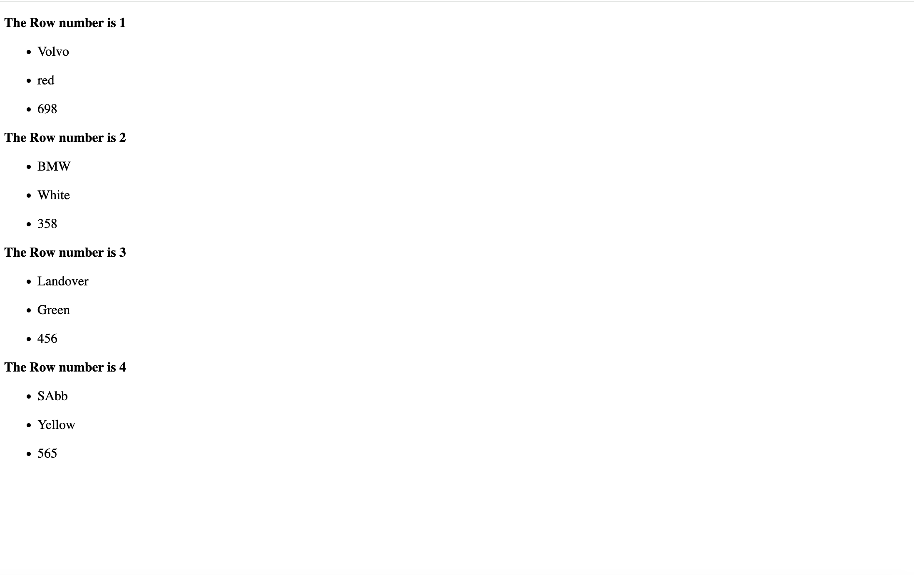

## Multidesimtional Array

#### Example 1

##### Intex PHP

```PHP
<!DOCTYPE html>
<!--
To change this license header, choose License Headers in Project Properties.
To change this template file, choose Tools | Templates
and open the template in the editor.
-->
<html>
    <head>
        <meta charset="UTF-8">
        <title></title>
    </head>
    <body>
        
        <?php
        
      $car= array(
          
          array("Volvo","red",899),
          array("Bmw","White",364),
          array("LandOver","Yellow",986),
          array("sabb","Green",569)
          
      );
       
      echo "The name of the car is ".$car[0][0]." and the color is ".$car[0][1]." the number is ".$car[0][2]."<hr>";
      echo "The name of the car is ".$car[1][0]." and the color is ".$car[1][1]." the number is ".$car[1][2]."<hr>";
      echo "The name of the car is ".$car[2][0]." and the color is ".$car[2][1]." the number is ".$car[2][2]."<hr>";
      echo "The name of the car is ".$car[3][0]." and the color is ".$car[3][1]." the number is ".$car[3][2]."<hr>";
              
        ?>
        
        
    </body>
</html>

```

#### OutPut 


#### Example 2

##### Index PHP

```PHP
<!DOCTYPE html>
<!--
To change this license header, choose License Headers in Project Properties.
To change this template file, choose Tools | Templates
and open the template in the editor.
-->
<html>
    <head>
        <meta charset="UTF-8">
        <title></title>
    </head>
    <body>
        
        <?php
        
       $car=[["Volvo","red",698],["BMW","White",358],["Landover","Green",456],["SAbb","Yellow",565]];
       
      echo "The name of the car is ".$car[0][0]." and the color is ".$car[0][1]." the number is ".$car[0][2]."<hr>";
      echo "The name of the car is ".$car[1][0]." and the color is ".$car[1][1]." the number is ".$car[1][2]."<hr>";
      echo "The name of the car is ".$car[2][0]." and the color is ".$car[2][1]." the number is ".$car[2][2]."<hr>";
      echo "The name of the car is ".$car[3][0]." and the color is ".$car[3][1]." the number is ".$car[3][2]."<hr>";
              
        ?>
        
    </body>
</html>
```
#### Output



#### Example 3

##### Index PHP

```PHP
<!DOCTYPE html>
<!--
To change this license header, choose License Headers in Project Properties.
To change this template file, choose Tools | Templates
and open the template in the editor.
-->
<html>
    <head>
        <meta charset="UTF-8">
        <title></title>
    </head>
    <body>
        
        <?php
        
       $car=[["Volvo","red",698],["BMW","White",358],["Landover","Green",456],["SAbb","Yellow",565]];
       
       for($row=0;$row<count($car);$row++){
           
           $nums=$row+1;#to start form 1.
		   
          echo "<p><b>The Row number is $nums</b></p>";
          
          for($a=0;$a<count($car[$a]);$a++){
              
              echo "<ul>";
              
              echo "<li>".$car[$row][$a]."</li>";
              
              echo "</ul>";
              
          }
       }
       
        ?>
         
    </body>
</html>

```

#### Output


