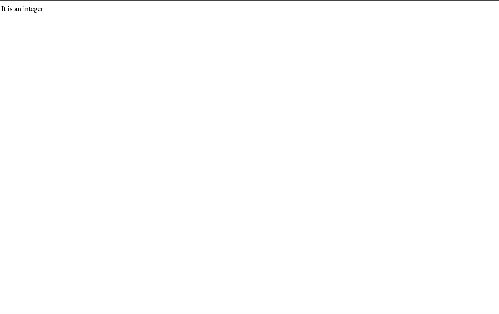
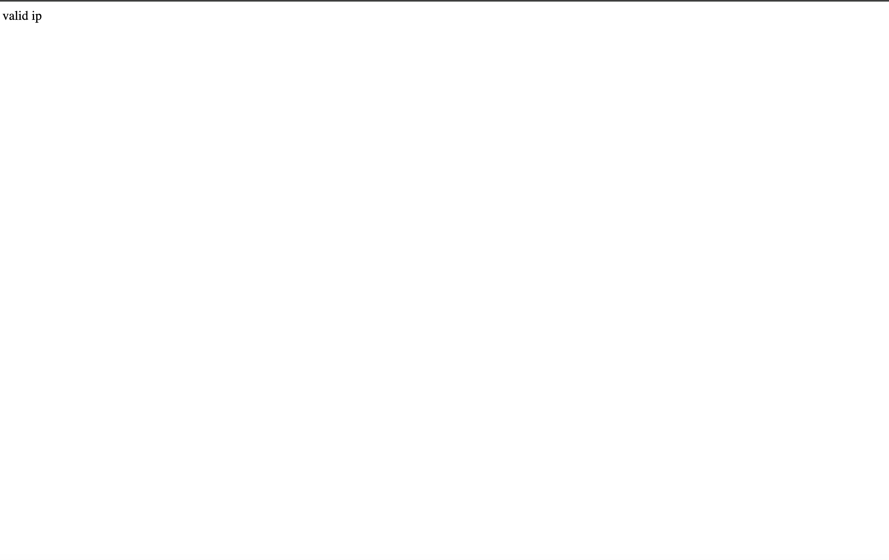
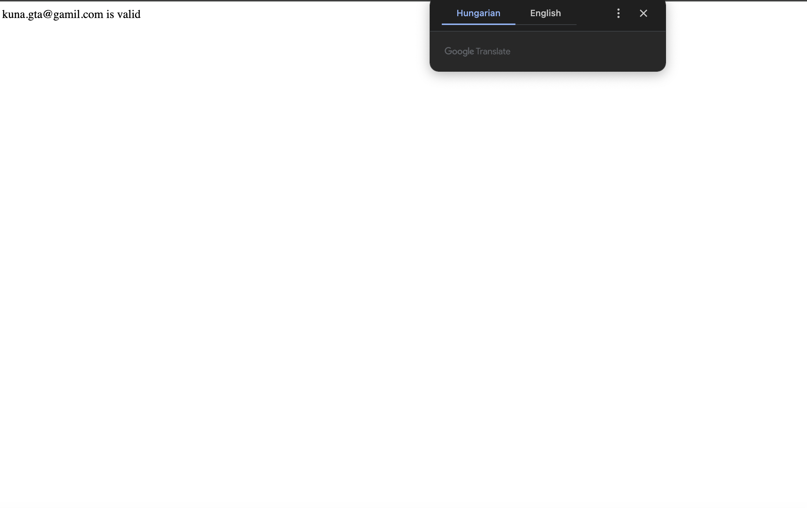
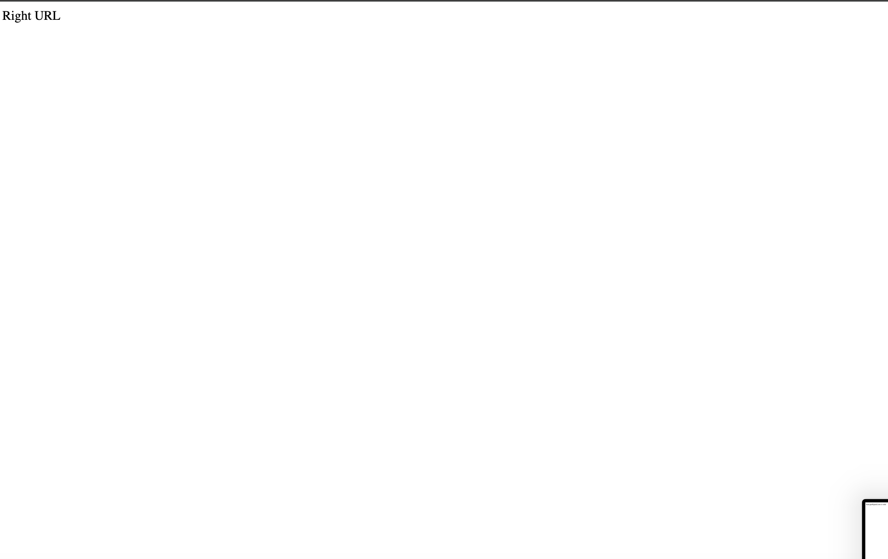
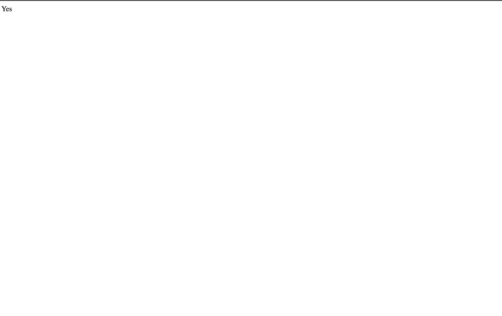
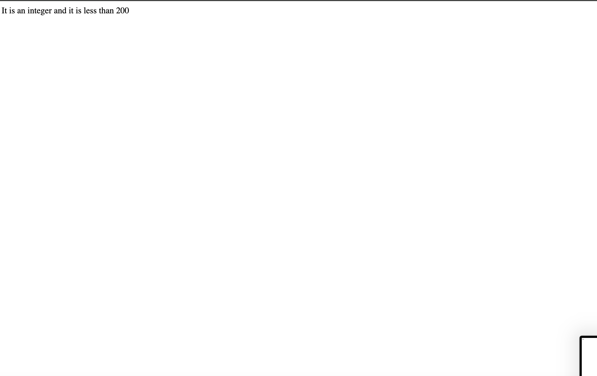

## Filter

#### Example 1

##### index.php

```PHP
<!DOCTYPE html>
<!--
To change this license header, choose License Headers in Project Properties.
To change this template file, choose Tools | Templates
and open the template in the editor.
-->

<html>
    
    <head>
        
        <meta charset="UTF-8">
        <title>This is the title</title>
    
    </head>
    
    <body> 
      
     <?php
     
     $int=50;
     
     if(!filter_var($int,FILTER_VALIDATE_INT)==FALSE){
         
         echo "It is an integer";
         
     }else{
         
         echo "It is not an integer";
         
     }
     
     //filter_var(theVariableToCheck,Type) is used to validate data.It has many validation type to perform.
     //filter_var() is used to validate email string number integer float ip address and more.
     ?>
     
    </body>
    
</html>
```

##### upload.php

```PHP

<?php
session_start();


echo $_SESSION["name"];

//session_unset() and session_destory() by using these methods we can delete session variables.
?>
```
#### Output 


#### Example 2

##### index.php

```PHP
<!DOCTYPE html>
<!--
To change this license header, choose License Headers in Project Properties.
To change this template file, choose Tools | Templates
and open the template in the editor.
-->

<html>
    
    <head>
        
        <meta charset="UTF-8">
        <title>This is the title</title>

    </head>
    
    <body>
     
     <?php
     
     $ip="175.0.0.1";
     
     if(!filter_var($ip,FILTER_VALIDATE_IP)==false){
         
         echo "valid ip";
         
     }else{
         
         echo "Not validate";
         
     }
     
     //The filter_var() function has many methods that checks if something is true or fake.
     
     ?>
     
    </body>
    
</html>
```

##### upload.php

```PHP

<?php
session_start();

echo $_SESSION["name"];

//session_unset() and session_destory() by using these methods we can delete session variables.
?>
```

#### Output 


#### Example 3

##### index.php

```PHP
<!DOCTYPE html>
<!--
To change this license header, choose License Headers in Project Properties.
To change this template file, choose Tools | Templates
and open the template in the editor.
-->

<html>
    
    <head>
        
        <meta charset="UTF-8">
        <title>This is the title</title>

    </head>
    
    <body>
      
     <?php
     
     $email="kuna.gta@gamil.com";
     $email= filter_var($email,FILTER_SANITIZE_EMAIL);//remove all illegal charaters.
     
     if(!filter_var($email,FILTER_VALIDATE_EMAIL)==false){
         
         echo "$email is valid";
         
     }else{
         
         echo "$email is not valid";
         
     }
     
     //The filter_var() function has many methods that checks if something is true or fake.
     
     ?>
     
    </body>
    
</html>

```

##### upload.php

```PHP

<?php
session_start();

echo $_SESSION["name"];

//session_unset() and session_destory() by using these methods we can delete session variables.
?>
```
#### Output 


#### Example 4

##### index.php

```PHP
<!DOCTYPE html>
<!--
To change this license header, choose License Headers in Project Properties.
To change this template file, choose Tools | Templates
and open the template in the editor.
-->

<html>
    
    <head>
        
        <meta charset="UTF-8">
        <title>This is the title</title>

    </head>
    
    <body>
      
     <?php
     
    $urr="http://localhost:8017/www.w3schools.com/php/php_filter.html";
    $url= filter_var($urr,FILTER_SANITIZE_URL);//SANITIZE is use to remove illegal charaters.
    
    if(filter_var($url,FILTER_VALIDATE_URL)==false){
       
        echo "Wrong Url";
        
    }else{
        
        echo "Right URL";
        
    }
     
     //The filter_var() function has many methods that checks if something is true or fake.
    //SANITIZE is for removing illegal charaters.
     
     ?>
     
    </body>
    
</html>

```

##### upload.php

```PHP

<?php
session_start();

echo $_SESSION["name"];

//session_unset() and session_destory() by using these methods we can delete session variables.
?>
```
#### Output 


#### Example 5

##### index.php

```PHP
<!DOCTYPE html>
<!--
To change this license header, choose License Headers in Project Properties.
To change this template file, choose Tools | Templates
and open the template in the editor.
-->

<html>
    
    <head>
        
        <meta charset="UTF-8">
        <title>This is the title</title>

    </head>
    
    <body>

        <?php
        
        $ip = "2001:0db8:85a3:08d3:1319:8a2e:0370:7334";
        if(!filter_var($ip,FILTER_VALIDATE_IP,FILTER_FLAG_IPV6)==false){
            
            echo "Yes";
            
        }else{
            
            echo "No";
            
        }
        //This appliation checks if it is IPV6
        
        ?>
     
    </body>
    
</html>

```

##### upload.php

```PHP

<?php
session_start();

echo $_SESSION["name"];

//session_unset() and session_destory() by using these methods we can delete session variables.
?>
```
#### Output 


#### Example 6

##### index.php

```PHP
<!DOCTYPE html>
<!--
To change this license header, choose License Headers in Project Properties.
To change this template file, choose Tools | Templates
and open the template in the editor.
-->


<html>

    <head>

        <meta charset="UTF-8">
        <title>This is the title</title>

    </head>

    <body>

        <?php
        $int = 123;
        $min = 0;
        $max = 200;

        if (!filter_var($int, FILTER_VALIDATE_INT) == false) {

        if($int>$min and $int<$max){
            
            echo "It is an integer and it is less than 200";
            
        }else{
            
           echo "It is an integer but it is gratar than 200";
            
        }
        
        } else {

            echo "It is not an integer";
        }
        ?>

    </body>

</html>

```

##### upload.php

```PHP

<?php
session_start();

echo $_SESSION["name"];

//session_unset() and session_destory() by using these methods we can delete session variables.
?>
```
#### Output 



